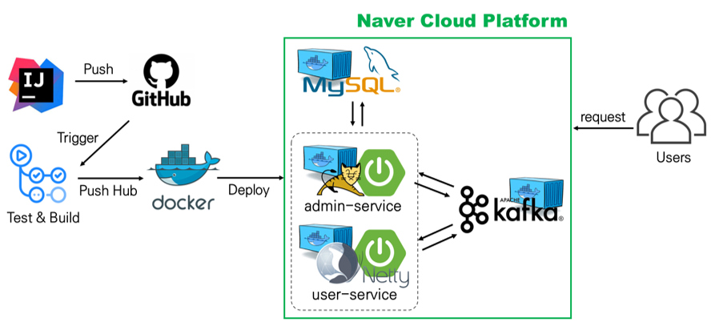

# bbaemin

<div style="text-align: center;"></div>

### 프로젝트 목표 및 중점사항
1. 배달의민족의 'B마트' 같은 E-Commerce Backend API 구현
2. 대용량 트래픽(부하의 변화)에도 장애 없이 **응답 속도**를 유지할 수 있도록 구현
   - 사용 중인 인프라가 예상 부하를 견딜 수 있는지 부하 테스트를 실시한다.
   - 응답 시간, 평균 대기 시간, CPU/메모리 사용률 등을 체크해 성능 병목 지점을 확인한다.
   - 개선 방안을 찾아 변경 전/후를 비교하고, 병목 현상을 해결한다.
     - [ ] Scale-Out
        - 인스턴스를 추가해 대응한다.
     - [X] Reactive System/Programming
        - Sync/Async, Blocking/Non-Blocking 개념을 이해하고, 응답 속도 저하의 원인을 파악한다.
        - Webflux, Kafka 등 비동기를 활용하여 외부 API를 호출한다.
3. CI/CD 환경 구축 및 테스트/배포 자동화
4. 모니터링
5. Git Flow를 활용한 브랜치 관리
6. 코드 리뷰를 통한 코드의 유지보수성 및 가독성 향상

### 프로젝트 구성 및 기술 스택
##### bbaemin (rootProject)
- Java 11, Spring Boot, Gradle, Kafka, JUnit5, Mysql
- CI/CD : Github Action, Docker
- Load Test & Monitoring : k6/nGrinder, Prometheus, Grafana, InfluxDB, Pinpoint, VisualVM
- Naver Cloud Platform
  
  ##### 1. admin-service
    - 관리자 API ([wiki 링크](https://github.com/f-lab-edu/bbaemin/wiki/Use-Case-&-API-:-Admin))
    - Spring Servlet Stack
      - Apache Tomcat, Spring MVC, JPA

  ##### 2. user-service
    - 사용자 API ([Wiki 링크](https://github.com/f-lab-edu/bbaemin/wiki/Use-Case-&-API-:-User))
    - Spring Reactive Stack
      - Netty, Spring WebFlux, R2DBC

  ##### 3. common

### CI/CD
- Github hook을 받아 Github Action에서 CI/CD를 진행한다.
Docker 이미지를 제작하여 배포합니다.
CI 서버에서 빌드 완료시 Shell script가 작동하여 빌드된 이미지가 docker hub에 저장됩니다.
Push 완료시 Delfood 메인 서버에서 docker hub에 올라간 이미지를 받아 실행시킵니다.
  https://velog.io/@soosungp33/CICD-%EA%B5%AC%EC%B6%95%EA%B8%B0
전체적인 흐름을 그림으로 정리해보자면 Develop 브랜치에 변경사항이 생길 때 Github Action이 각 애플리케이션 마다 설정해둔 Dockerfile을 읽어서 Docker Image를 만들고 Docker Hub에 push하게 됩니다.

build과정을 성공적으로 완료하게 되면 Github Action이 서버 환경에서 설정해둔 스크립트를 실행하게 되는데 Docker Hub에 올려놓은 이미지들을 pull 받고 Docker Compose로 총 4개의 컨테이너를 띄워서 배포까지 자동으로 완료하게 되는 흐름을 가지고 있습니다.

### 프로젝트 구조 (V1)
<div style="text-align: center;"></div>

### 부하 테스트
##### 1. OrderService
###### 1) 주문 
  ```text
  [주문 과정]
  
  ```
  - dfd

###### 2) 주문 취소

##### 2. ReviewService
###### 1) 리뷰 조회 
###### 2) 리뷰 등록
- Spring Servlet Stack + Kafka
- Spring Reactive Stack
- Spring Reactive Stack + Kafka
