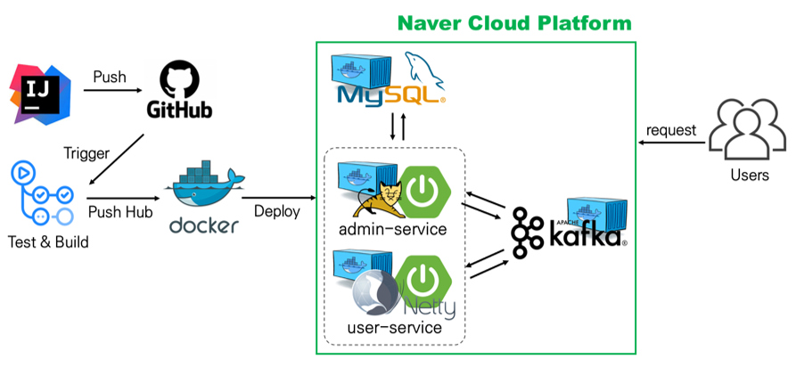

# bbaemin

 

 

### :star: 프로젝트 목표 및 중점사항
- 배달의 민족 'B마트' 같은 E-Commerce Backend API 구현  

- 대용량 트래픽(부하의 변화)에도 장애 없이 **응답 속도**를 유지할 수 있도록 구현
   - 사용 중인 인프라가 예상 부하를 견딜 수 있는지 부하 테스트를 실시한다.
   - 응답 시간, 평균 대기 시간, CPU/메모리 사용률 등을 체크해 성능 병목 지점을 확인한다.
   - 개선 방안을 찾아 변경 전/후를 비교하고, 병목 현상을 해결한다.

     - [ ] **Scale Out, Scale Up**
        - 인스턴스를 추가해 대응한다.
     
     - [X] **Reactive System/Programming**
        - Sync/Async, Blocking/Non-Blocking 개념을 이해하고, 응답 속도 저하의 원인을 파악한다.
        - Webflux, Kafka 등 비동기를 활용하여 외부 API를 호출한다.

- CI/CD 환경 구축 및 테스트/배포 자동화

- 모니터링 환경 구축

- Git Flow를 활용한 브랜치 관리

- 코드 리뷰를 통한 코드의 유지보수성 및 가독성 향상

 

### :star: 프로젝트 구성 및 기술 스택
### bbaemin (rootProject)
- Java 11, Spring Boot, Gradle, Kafka, JUnit5, Mysql
- CI/CD : Github Action, Docker
- Load Test & Monitoring : k6/nGrinder, Prometheus, Grafana, InfluxDB, Pinpoint, VisualVM
- Naver Cloud Platform

#### 1. admin-service
- [관리자 API](https://github.com/f-lab-edu/bbaemin/wiki/Use-Case-&-API-:-Admin)
- 상품, 상점, 배달, 결제 관련 서비스
- Spring Servlet Stack
  - Apache Tomcat, Spring MVC, JPA

#### 2. user-service
- [사용자 API](https://github.com/f-lab-edu/bbaemin/wiki/Use-Case-&-API-:-User)
- 장바구니, 주문, 리뷰 관련 서비스
- 상대적으로 admin-service보다 트래픽이 더 높고 그 변화 폭이 더 클 것으로 예상되어 Reactive Stack으로 전환
- Spring Reactive Stack
  - Netty, Spring WebFlux, R2DBC

#### 3. common
- 각 모듈에서 공통적으로 사용하는 클래스 모음
- Response, Dto, Config 클래스 등

 

### :star: CI/CD
- main 브랜치에 Push/Pull-Request가 발생할 때마다 Github Action에서 테스트를 실시하고, 그 결과를 보고한다.
- PR이 Merge 되면 Github Action이 각 서비스마다 설정해둔 Dockerfile을 읽어 Docker Image를 만들고 Docker Hub에 Push한다.
- Build가 완료되면 (스크립트를 실행해) Docker Hub에 올려놓은 이미지를 Pull 받아 Docker Compose로 각 컨테이너를 띄워 배포까지 완료한다.

 

### :star: 프로젝트 구조

 

### :star: Wiki
https://github.com/f-lab-edu/bbaemin/wiki
